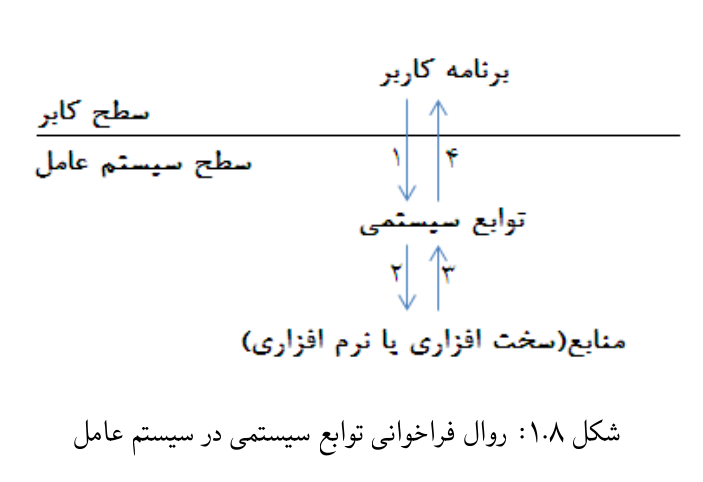

# آزمایش ۸ − آشنایی با توابع سیستمی

## ۸.۱ مقدمه

یک برنامه در حین اجرا لازم است به منابعی همچون یک فایل
دسترسی داشته باشد. درخواست دسترسی به این منابع توسط 
توابع سیستمی، به سیستم عامل ارائه می‌گردد.
(توابع سیستمی یا فراخوانی‌های سیستمی و یا System Calls)

هدف این آزمایش آشنایی دانشجویان با توابع سیستمی و نحوه
عملکرد آن‌ها است. به عبارت دیگر، اهداف این آزمایش عبارتند
از:

1. آشنایی با توابع سیستمی
1. آشنایی با روش‌های قلاب کردن به توابع سیستمی
1. بررسی کاربرد فلاب کردن به توابع سیستمی برای مقابله با بد‌افزارها
1. آشنایی با ایجاد ماژول‌های سطح هسته (Kernel Modules)
 
## ۸.۲  پیش‌نیاز نظری

سیستم عامل رابطی بین کاربر و سخت‌افزار است که هدف آن
آسان‌سازی استفاده کاربر از منابع سیستمی است. به عبارت
دیگر سیستم عامل وظیفه مدیریت منابع سیستمی همانند حافظه،
پردازنده و درگاه‌های شبکه را بر عهده دارد. بطور معمول
سیستم‌های عامل مدیریت این منابع را به وسیله توابع خاصی 
که بدین منظور طراحی شده‌اند انجام می‌دهد. به این توابع،
توابع سیستمی و یا رابط برنامه‌نویسی کاربردی می‌گویند
 (API).

درخواست منبع می‌تواند درخواست سرویس سخت‌افزاری همانند
دسترسی به دیسک سخت و یا سرویس‌های نرم‌افزاری همانند درخواست
ایچاد یک پردازه جدید باشد.

یک نرم‌افزار در طول اجرا، منابعی را در خواست می کند. این
منابع و یا درخواست‌های ارسالی توسط نرم‌افزار، عموما در پنج
رده دسته‌بندی می‌شود که عبارتند از:

1. درخواست‌های مرتبط با فایل: این درخواست‌ها شامل ایجاد،
کپی، خواندن و یا نوشتن اطلاعات در / از یک فایل است.
1. درخواست‌های مرتبط با پردازه: این درخواست‌ها شامل ایجاد،
حذف و تغییر خصوصیات یک پردازه و یا ریسه است. همچنین
درخواست‌های مرتبط با دریافت لیست پردازه‌های در حال اجرا،
تزریق داده در فضای آدرس پردازه‌ها، ایجاد ریسه‌های از راه دور
جزء این دسته هستند.
1. درخواست‌های مرتبط با پنجره‌ها: این درخواست‌ها شامل
ایجاد پنجره، دریافت کلیدهای فشرده شده درصفحه کلید و یا
نمایش اطلاعات در صفحه نمایش است.
1. درخواست‌های مربوط به شبکه: این درخواست‌ها شامل اتصال و
گوش دادن به درگاه‌های شبکه و ارسال اطلاعات از طریق شبکه است.
1. سایر درخواست‌ها: درخواست‌هایی همانند درخواست زمان سیستم
و زمانبندی پردازه‌ها جزء این دسته هستند.

در نهایت می‌توان گفت که فراخوانی سیستمی، رابطی بین یک
پردازه (برنامه کاربر) و سیستم عامل است؛ بدین طریق که برنامه
کاربر درخواست منابع خود را از طریق این توابع به سیستم
عامل ارئه می‌کند.

بر اساس شکل ۸.۱ درخواست‌ یک فراخوانی سیستمی توسط برنامه
شامل موارد زیر است.

1. ابتدا برنامه سطح کاربر با توجه به منبع مورد نیاز،
تابع سیستمی مربوطه را فراخوانی می‌نماید. این امر باعث تغییر
سطح اجرایی (از سطح کاربر به سطح سیستم عامل) می‌گردد.
1. سیستم عامل با سخت‌افزار برای پاسخ به درخواست
 ارسال تعامل می‌کند. البته باید به این نکته توجه نمود که درخواست
دسترسی به منابع تنها محدود به منابع سخت‌افزاری نمی‌شود و
منبع می‌تواند یک منبع نرم‌افزاری باشد.
1. پاسخ سخت‌افزار به درخواست سیستم عامل
1. ارسال نتیجه عملیات از تابع سیستمی به برنامه کاربر
جهت بررسی صحت نتایج و تغییر سطح اجرایی از سطح سیستم
عامل به سطح کاربر.

در تمامی سیستم‌های عامل داده ساختاری به صورت جدول وجود
دارد که آدرس تمام توابع سیستمی در آن ذخیره می‌گردد.
به این جدول «جدول توابع سیستمی» می‌گویند.
به عنوان مثال بخشی از توابع سیستمی در هسته سیستم عامل
لینوکس نسخه ۴.۶ در جدول زیر نشان داده شده است.
لازم به ذکر است که در این هسته حدود ۳۲۸ تابع سیستمی وجود
دارد.

 
| *rax* | *System call* | *rdi*                | *rsi*                | *rdx*        |
| :---: | :------------ | :------------------- | :------------------- | :----------- |
|   0   | sys_read      | unsigned int fd      | char *buf            | size_t count |
|   1   | sys_read      | unsigned int fd      | const char *buf      | size_t count |
|   2   | sys_open      | const char *filename | int flags            | int mode     |
|   3   | sys_close     | unsigned int fd      |                      | ‌             |
|   4   | sys_stat      | const char *filename | struct stat *statbuf |              |
|   5   | sys_fstat     | unsigned int fd      | struct stat *statbuf |              |
|   6   | sys_lstat     | const char *filename | struct stat *statbuf |              |
|  ...  | ...           | ...                  | ...                  | ...          |

 
 
## ۸.۳ آزمایش ۱

یک ماژول سطح هسته بنویسید که آدرس تمام توابع سیستمی موجود
در هسته سیستم‌عامل لینوکس را چاپ کند.
(راهنمایی: لیست توابع سیستمی و تعداد آن‌ها در فایل سرآیند
unistd.h
از هسته سیستم عامل وجود دارد.
[link](https://elixir.bootlin.com/linux/latest/source/include/uapi/asm-generic/unistd.h)
)

 - [1](https://marcin.juszkiewicz.com.pl/download/tables/syscalls.html)
 - [2](https://memset.wordpress.com/2011/03/18/syscall-hijacking-dynamically-obtain-syscall-table-address-kernel-2-6-x-2/)
 - [3](https://unix.stackexchange.com/questions/421750/where-do-you-find-the-syscall-table-for-linux)
 - [4](https://marcin.juszkiewicz.com.pl/download/tables/syscalls.html)
 
انتظار می‌رود خروجی این آزمایش شامل موارد زیر باشد.

1.  کد پیاده‌سازی شده توسط دانشجو
1. یک مستند که حاوی موارد زیر است.
  * توضیحاتی در خصوص کد ارائه شده
  * تصاویر از خروجی برنامه
  * توضیحاتی در مورد نیازمندی‌های لازم جهت اجرای برنامه
  
## ۸.۴ آزمایش ۲

با تغییر آدرس توابع موجود در جدول توابع سیستمی و جایگزینی
آدرس تابع دلخواه به جای تابع اصلی می‌توان عملکرد توابع
سیستمی را تغیر داد. به این عمل اصطلاحا قلاب کردن (هوک کردن)
یا Hooking گفته می‌شود. با طراحی یک ماژول سطح هسته در
سیستم عامل لینوکس، فایل‌های موجود در دایرکتوری Home سیستم
عامل خود را پنهان نمایید.ابزارهای ضد بدافزار و یا
بدافزارها از این روش چه بهره‌ای می‌برند؟ انتظار می‌رود خروجی
این آزمایش شامل موارد زیر باشد.

1. کد پیاده سازی شده توسط دانشجو
1. یک مستند که حاوی موارد زیر است
  * توضیحاتی در خصوص کد ارائه شده
  * تصاویری از خروجی برنامه
  * توضیجاتی در مورد نیازمندی‌های لازم جهت اجرای برنامه 

 
 - [superhide](https://github.com/jordan9001/superhide)
 - [Guest Diary (Etay Nir) Kernel Hooking Basics](https://isc.sans.edu/forums/diary/Guest+Diary+Etay+Nir+Kernel+Hooking+Basics/23155/)

